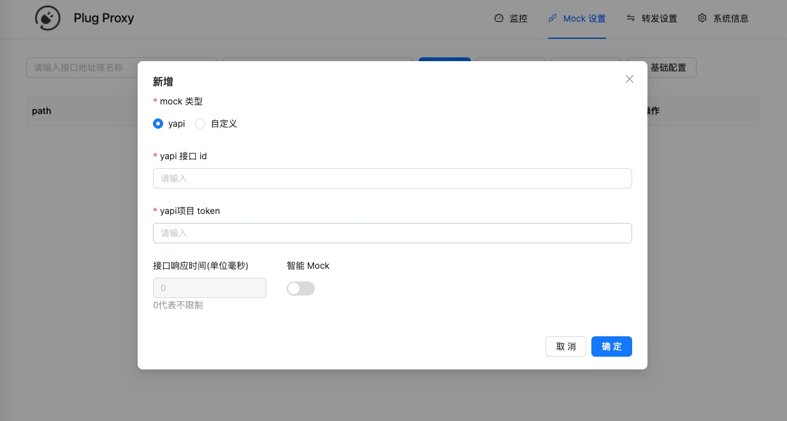
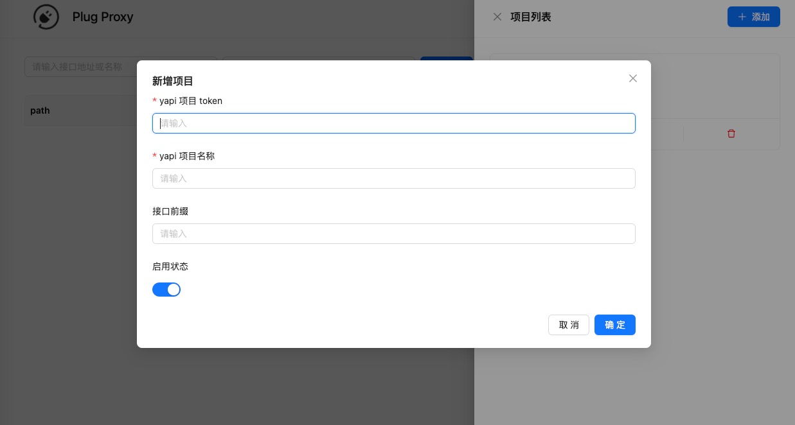
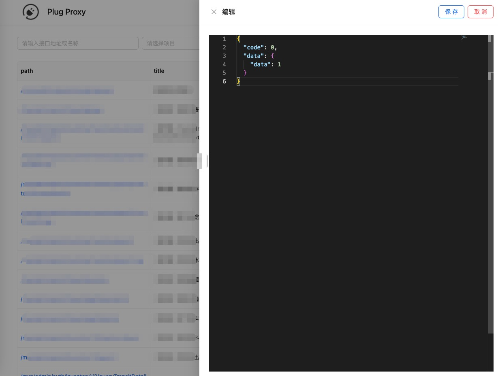
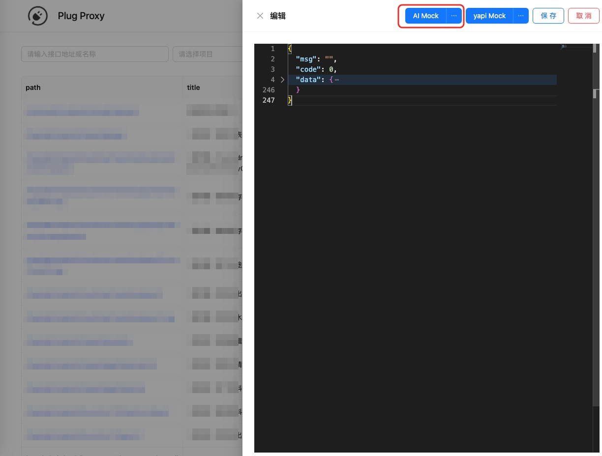

# mock

`plug` 支持单个/批量接口的 `mock`，同时 `plug` 支持基于大模型 + `YAPI schema` 的 `mock` 能力

## 单个接口 mock

点击 `mock` 接口面的 “添加接口” 按钮后会弹出创建弹窗，其中有两种模式：

- yapi：根据接口 `id` 和项目 `token` 来创建  
- 自定义：根据接口地址来 `mock`  

{data-zoomable}  

## 批量接口 mock

批量接口 `mock` 是根据 `yapi` 项目来创建的.

- 1、在 `mock` 界面点击 “项目管理” 按钮   
- 2、在弹出的弹窗点击 “添加” 按钮    
- 3、输入项目 `token` 后，`plug` 会去 `yapi` 上抓取当前项目下的所有接口进行 `mock`  

{data-zoomable}

## 手动修改 mock 数据

创建需要 `mock` 接口的接口后，我们可以通过列表上的 `Mock` 按钮调整 `mock` 数据

> 如果是通过 `yapi` 创建的 `mock` 接口，会自动拉取该接口在 `yapi` 上的 `mock` 数据

{data-zoomable}

::: tip mock 编辑器
`plug` 采用了 `monaco-editor(在线版 vscode)` 作为 `mock` 编辑器，但是只引入了 `json` 语言
:::

## 大模型 mock 数据

`plug` 提供了基于大模型 + `YAPI schema` 来自动 `mock` 的能力。如果是通过 `yapi` 创建的接口，在 `Mock` 数据页面的顶部，会有个 `AI Mock` 的按钮，如下所示： 

> **注意：使用 `AI Mock` 的前提是需要在 【系统信息】- 【模型管理】里配置好使用的模型信息**

{data-zoomable}

点击 `AI Mock` 按钮后，会使用 `stream` 流的形式进行 `mock`，具体的交互流程如下：

<video controls width="100%">
  <source src="./images/mock-by-llm-process.mov">
  您的浏览器不支持 HTML5 视频。
</video>

::: tip 自定义 mock 请求参数
`AI Mock` 和 `yapi Mock` 可选择 【自定义请求参数】，可以添加 `yapi` 上的默认请求参数或者分页参数
:::