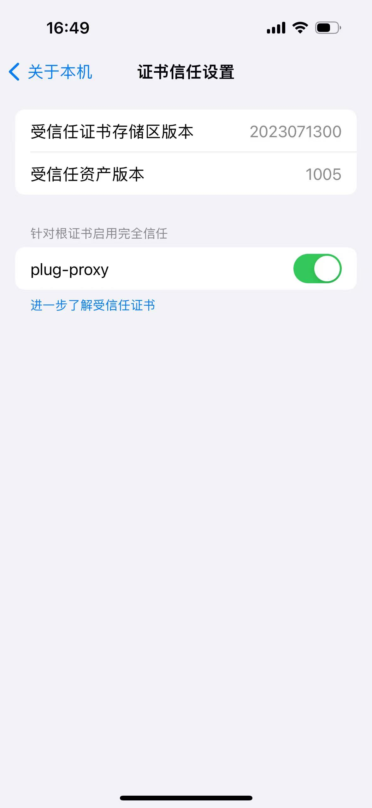

# 移动端使用

本章会主要介绍如何在移动端使用。

::: warning 网络确认
使用前注意，移动端和手机端需要连接到同一个无线网内的同一网段，否则可能无法正常使用。
:::

## IOS 手机

### 1、 安装证书: 手机扫码安装证书

### 2、 信任
依次点击【设置】-【通用】-【关于本机】-【证书信任设置】，信任 `plug-proxy` 证书

{data-zoomable width=200}

### 3、 设置代理
查看手机连接的无线网配置，开启【配置代理】，并配置成如下形式：

{data-zoomable width=200}

## Android 手机

欢迎补充