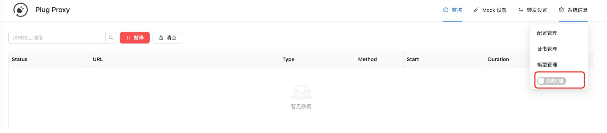

# pc 端使用

本章会依次介绍如何在 `pc` 端使用 `plug`

## 全局代理
在 `plug` 控制台页面里，可通过界面开启【系统代理】，开启之后会代理电脑上的所有请求。

{data-zoomable}

::: tip 关于全局代理
- 在 `plug` 上开启系统代理后，原先配置的【科学上网】代理会生效，可以参考 [系统代理端口](./system-config.md#系统代理端口) 解决代理后不能【科学上网】的问题  
- 在 `plug` 上关闭系统代理后，需要重新开启【科学上网】工具的【设置系统代理】
:::

## 局部代理

局部代理是指在特定的电脑应用里使用 `plug` 代理请求

### 在浏览器中使用  

首先需要在浏览器中安装 [Proxy SwitchyOmega](https://chromewebstore.google.com/detail/proxy-switchyomega/padekgcemlokbadohgkifijomclgjgif?hl=zh-CN&utm_source=ext_sidebar) 插件（谷歌浏览器的插件链接地址）

> 这个插件是用来将浏览器上的接口请求代理到指定 ip 的

安装后打开插件，点击 `选项` 按钮，在代理服务器中配置一下内容：

配置完成后，再次点击插件，选择刚才配置的模式，这时，浏览器上的接口请求就会被代理到本地了

可以在 `http://localhost:9001/management` 看下是否有接口代理过来

### 小程序开发者工具  

在小程序开发者工具上配置以下代理信息：

然后按照要求重启开发者工具即可

::: tip
在支付宝开发者工具上，需要重启一下才能生效（如果不行，需要将项目删除重新导入）。在微信开发者工具上不需要重启
:::